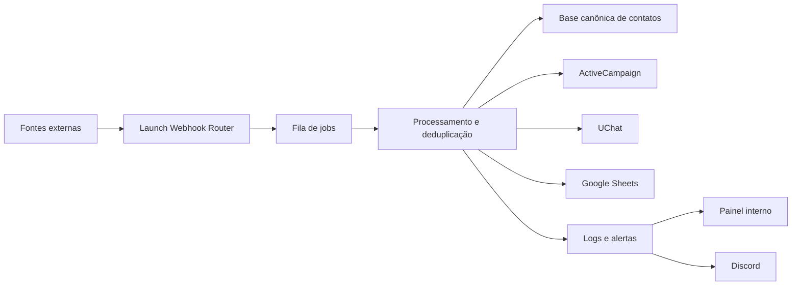

# Launch Hub

Launch Hub é uma plataforma interna da Megafone Digital para centralizar, tratar e rotear contatos recebidos por webhooks e integrações de marketing, automação e captura. O sistema atua como uma camada intermediária entre plataformas como ActiveCampaign, UChat, Sendflow, ManyChat, Typebot, Tally e Google Sheets, com foco em reduzir duplicidades, padronizar dados, registrar eventos operacionais e manter rastreabilidade sobre cada etapa do processamento.

O projeto nasceu para substituir fluxos dispersos de automação por um hub próprio, mais visual, auditável e controlado. Em vez de cada ferramenta conversar diretamente com outra sem contexto, o Launch Hub recebe os sinais, normaliza os dados, aplica regras do expert/ciclo, registra logs, enfileira trabalhos assíncronos e executa as ações externas necessárias.

## Propósito do sistema

O Launch Hub foi desenhado para apoiar operações de lançamento, captura e relacionamento da Megafone Digital. Ele permite que a equipe conecte fontes diferentes, trate contatos recebidos, aplique tags, envie informações para o ActiveCampaign, registre capturas em planilhas e dispare fluxos no UChat quando configurado.

Principais objetivos:

- Centralizar webhooks de diferentes plataformas em uma única camada controlada.
- Normalizar telefone, e-mail, nome, tags, origem e metadados antes de qualquer roteamento.
- Evitar duplicidade de contatos no banco interno, no ActiveCampaign e em planilhas.
- Separar dados por expert, mantendo leads, logs, filas e configurações isolados por contexto.
- Permitir que administradores acompanhem integrações, logs, usuários e alertas em um painel visual.
- Reduzir dependências manuais de ferramentas externas como n8n para fluxos recorrentes.
- Manter histórico técnico e operacional para investigação de falhas e auditoria.

## Visão geral da arquitetura

O sistema é dividido em três camadas principais:

- Frontend React: painel administrativo usado pela equipe Megafone para configurar experts, fontes, regras, logs, filas, usuários, alertas e integrações.
- Supabase Database: camada de persistência para autenticação, perfis, experts, contatos canônicos, identidades externas, eventos, jobs, logs, configurações e estados de reconciliação.
- Supabase Edge Functions: backend serverless responsável por receber webhooks, processar jobs, chamar APIs externas, realizar OAuth com Google, sincronizar catálogos e proteger operações sensíveis.

Fluxo conceitual:



## Tecnologias utilizadas

### Frontend

- React 18 para a aplicação principal.
- TypeScript para tipagem estática.
- Vite como bundler e ambiente de build.
- React Router para rotas autenticadas e páginas públicas.
- TanStack Query para suporte a cache e operações assíncronas.
- Tailwind CSS para estilo utilitário.
- shadcn/ui e Radix UI para componentes acessíveis.
- Lucide React para iconografia.
- Sonner e sistema de toast para feedback visual.
- React Hook Form e Zod disponíveis para formulários e validações.

### Backend e banco

- Supabase Auth para autenticação.
- Supabase Postgres para dados relacionais.
- Row Level Security para controle de acesso por usuário, admin e expert.
- Supabase Edge Functions em Deno para execução serverless.
- Supabase Realtime/queries e RPCs para leitura controlada no front.
- pg_cron e pg_net em rotinas agendadas quando necessário.
- Vault/secrets do Supabase para credenciais sensíveis do backend.

### Integrações externas

- ActiveCampaign para tags, contatos, listas e eventos de automação.
- UChat para disparo de subflows e interação com subscribers.
- Sendflow para eventos de entrada em grupo e boas-vindas.
- ManyChat para eventos de captura e complementação de cadastro.
- Typebot para captura e roteamento de contatos.
- Tally para formulários e pesquisas.
- Google OAuth e Google Sheets para listar planilhas/abas e registrar capturas.
- Discord Webhook para alertas operacionais de erro.

## Módulos do painel

### Dashboard

Visão executiva do ambiente ativo, com resumo do expert selecionado, status do backend, validação visual do schema e indicadores rápidos da operação. A tela também concentra a linguagem visual da Megafone Digital e funciona como ponto de entrada do painel.

### Experts

Módulo responsável pelo cadastro e organização dos experts. Substitui a antiga ideia de lançamentos isolados, mantendo cada operação separada por expert e permitindo que usuários sejam vinculados a um ou mais experts.

### Fontes

Área de conexão e configuração das plataformas externas. Reúne credenciais, tokens, URLs de API, tags vindas do ActiveCampaign, Google Sheets, UChat, Sendflow e demais fontes conectadas ao expert.

### Regras

Módulo dedicado a critérios de tratamento e roteamento. Mantém definições de estados, tags, aliases, tratamento de duplicatas, fluxos esperados e configurações operacionais que orientam os webhooks.

### Leads

Lista os contatos que chegaram pelos webhooks do Launch Hub. A base de leads visível é separada de sincronizações técnicas e prioriza contatos efetivamente capturados pela operação, com informações de origem, status, mesclas e atualização.

### Fila

Mostra o estado dos jobs assíncronos de webhook. A fila usa status claros como `pending`, `running`, `success`, `failed`, `retrying` e `dead_letter`, permitindo entender se um evento foi aceito, processado, reprocessado ou isolado por falha.

### Logs

Exibe logs operacionais relevantes para o usuário, separados dos logs técnicos mais detalhados. Essa divisão reduz ruído no painel e preserva informações profundas para investigação sem sobrecarregar a operação diária.

### Configurações

Centraliza dados do perfil, troca de senha, conexão Supabase, validação de schema, administração de usuários, vínculo de usuários a experts e configuração de alertas. Admins possuem acesso ampliado para governança da plataforma.

### Termos e Privacidade

Rotas públicas com Termos de Serviço e Política de Privacidade, voltadas ao uso interno da ferramenta e ao atendimento de requisitos de integrações como Google OAuth.

## Edge Functions presentes

### launch-webhook-router

Função principal para entrada de webhooks. Recebe eventos de fontes externas, valida expert/token, cria jobs, responde rapidamente para evitar timeout de plataformas externas e processa a fila em background. Também coordena deduplicação, logs, roteamento para ActiveCampaign, UChat e Google Sheets.

### process-contact-event

Função histórica/auxiliar para processamento de eventos de contato. Mantida para compatibilidade com partes do sistema e fluxos anteriores.

### activecampaign-catalog

Consulta catálogos do ActiveCampaign, principalmente tags disponíveis, para permitir que o painel vincule tags reais da conta aos fluxos de Typebot, ManyChat, Sendflow, Tally e outros webhooks.

### activecampaign-sheets-reconcile

Executa reconciliação entre ActiveCampaign e Google Sheets. Procura contatos com tag configurada e garante que capturas elegíveis sejam enviadas para a planilha, respeitando deduplicação e loteamento.

### sync-platform-contacts

Função de sincronização de contatos entre plataformas. Algumas rotinas de sincronização pesada foram pausadas em favor de webhooks e reconciliações mais controladas, mas a estrutura permanece disponível para usos futuros.

### google-oauth-exchange

Realiza troca de código OAuth por tokens do Google, permitindo conectar uma conta Google autorizada ao expert.

### google-oauth-disconnect

Remove/desconecta a integração Google vinculada, limpando o estado de conexão quando necessário.

### google-sheets-catalog

Lista planilhas e abas disponíveis na conta Google conectada para configuração de destino de capturas.

### supabase-project-connector

Permite validar e alternar conexões de projeto Supabase em runtime, apoiando desenvolvimento, homologação e verificação de schema.

### admin-user-management

Executa ações administrativas sensíveis que não devem ficar expostas diretamente no frontend, como redefinição de senha e remoção de usuários.

## Modelo de dados principal

O schema do Supabase cobre as seguintes áreas:

- `profiles`: usuários, status de aprovação, papel admin, troca obrigatória de senha e dados básicos de perfil.
- `launches`: entidade operacional ainda usada no banco para representar experts/ciclos no app.
- `launch_user_assignments`: vínculo entre usuários comuns e experts que eles podem gerenciar.
- `lead_contacts`: contato canônico tratado pelo Launch Hub.
- `lead_contact_identities`: identidades externas associadas a um contato, como ActiveCampaign, ManyChat, UChat e outras fontes.
- `inbound_contact_events`: eventos recebidos pelos webhooks.
- `launch_webhook_jobs`: fila assíncrona de processamento de webhooks.
- `contact_processing_logs`: logs operacionais visíveis no painel.
- `contact_technical_logs`: logs técnicos detalhados com retenção curta.
- `contact_routing_actions`: registros de ações de roteamento executadas ou tentadas.
- `launch_google_sheet_capture_records`: controle de envios para planilhas e deduplicação de capturas.
- `launch_google_sheet_reconcile_state`: estado da reconciliação periódica entre ActiveCampaign e Google Sheets.
- `platform_rate_limit_windows`: controle de chamadas por plataforma para respeitar limites externos.
- `platform_alert_settings`: configuração global de alertas, incluindo Discord.
- `alert_delivery_logs`: histórico técnico de entregas de alertas.

## Fluxos suportados

### ActiveCampaign para Launch Hub

O sistema recebe eventos do ActiveCampaign, identifica contato, normaliza dados, aplica proteções contra conflito de e-mail/telefone, registra logs e pode encaminhar dados para Google Sheets ou UChat quando o evento possui configuração explícita.

### Typebot, ManyChat e Tally para ActiveCampaign

Webhooks de captura podem criar ou atualizar contatos no ActiveCampaign com tags escolhidas no painel. Antes do envio, o Launch Hub tenta identificar se o contato já existe e evita criar duplicatas por variações de telefone, e-mail ou identidade externa.

### Sendflow para UChat e ActiveCampaign

Eventos de entrada em grupo podem ser usados para acionar fluxo de boas-vindas no UChat e aplicar tags no ActiveCampaign, conforme configuração do expert. O sistema possui proteções para evitar envio repetido do mesmo template em um mesmo evento.

### UChat para Launch Hub

Eventos vindos do UChat podem alimentar a base canônica e, quando configurado, aplicar tags e enviar dados para o ActiveCampaign. O retorno para subflow de boas-vindas foi direcionado principalmente para o fluxo de Sendflow, evitando disparos indevidos.

### Google Sheets

O Launch Hub conecta uma conta Google autorizada, lista planilhas e abas, e envia capturas com campos mapeados como data, nome, e-mail, telefone, tipo de lead, produto, UTMs e identificadores de origem.

### Discord

Erros operacionais podem ser enviados para um canal Discord via webhook configurado por admin. Os alertas são mascarados para reduzir exposição de dados sensíveis e contam com intervalo antispam.

## Regras de confiabilidade

O sistema inclui mecanismos para suportar operações com alto volume e reduzir efeitos colaterais:

- Processamento assíncrono de webhooks para responder rapidamente a plataformas externas.
- Fila com estados claros e reprocessamento de jobs travados.
- Idempotência por evento para evitar duplicação de lead, planilha ou disparo.
- Deduplicação por telefone, e-mail, identidade externa e chaves normalizadas.
- Rate limit por plataforma para controlar chamadas ao ActiveCampaign, UChat e Google Sheets.
- Separação entre logs operacionais e técnicos.
- Alertas externos para falhas críticas.
- Proteções contra sobrescrita de dados quando há conflito de identidade.

## Segurança e governança

O Launch Hub usa uma combinação de controles no frontend, banco e Edge Functions:

- Cadastro restrito a e-mails `@megafone.digital`.
- Aprovação administrativa para usuários não seedados como admins.
- Lista de admins iniciais definida em código/migrations.
- Troca obrigatória de senha no primeiro acesso.
- RLS para limitar leitura e escrita conforme usuário, admin e expert.
- Credenciais sensíveis protegidas por RPCs e não expostas em consultas comuns.
- Edge Functions com `verify_jwt` quando apropriado para chamadas autenticadas.
- Webhooks públicos protegidos por token de expert/fonte.
- Logs técnicos com sanitização de tokens, senhas, chaves e payloads extensos.
- Configurações administrativas separadas da operação comum.

## Identidade visual

A interface segue a identidade visual da Megafone Digital, com fundo azul profundo, grid luminoso, ciano como cor de destaque, elementos espaciais e componentes com atmosfera de cockpit operacional. O objetivo visual é reforçar a ideia de controle, amplificação e previsibilidade sem perder clareza operacional.

## Estrutura do projeto

```text
src/
  components/          Componentes de layout, autenticação, cards e UI
  contexts/            Contextos de autenticação e expert ativo
  integrations/        Cliente Supabase e tipos gerados
  pages/               Telas principais do painel
  hooks/               Hooks compartilhados
  lib/                 Utilitários

supabase/
  functions/           Edge Functions e módulos compartilhados
  migrations/          Evolução versionada do schema
  bootstrap.sql        Consolidado para inicialização de ambiente novo
  config.toml          Configuração das Edge Functions

docs/
  politica-de-privacidade.md
  termos-de-servico.md
```

## Estado atual

O Launch Hub já opera como hub interno de webhooks e roteamento, com foco em experts, filas assíncronas, logs, deduplicação, ActiveCampaign, UChat, Sendflow, ManyChat, Typebot, Tally, Google Sheets e alertas Discord.

A evolução do sistema prioriza confiabilidade, segurança e durabilidade em operações de grande escala, mantendo a experiência visual simples para a equipe e concentrando a complexidade no backend controlado.
